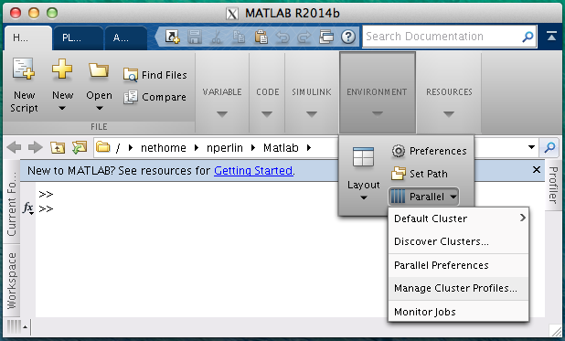
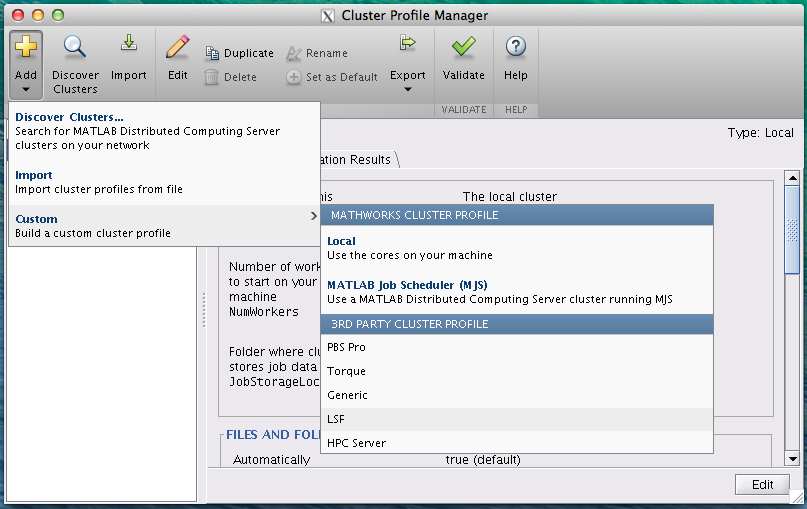
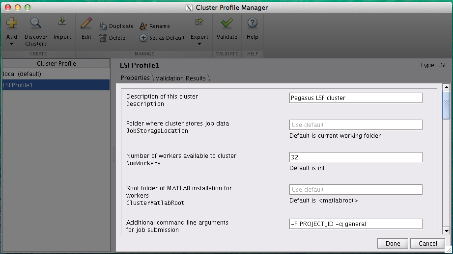

Matlab on Pegasus
=================

Interactive Mode
----------------

There are several ways to run MATLAB commands/jobs interactively, with
or without the graphical interface.

Graphical Interface Mode
~~~~~~~~~~~~~~~~~~~~~~~~

To run MATLAB using graphical interface mode, connect with display
forwarding. For more information about display forwarding, see
:ref:`Forwarding the Display <x11>`.

Load and launch MATLAB on one of the interactive compute nodes as shown
below. If you belong to more than one project, specify the ``projectID``
as well.

::

    [username@pegasus ~]$ module load matlab
    [username@pegasus ~]$ bsub -Is -q interactive -XF -P projectID matlab

Once the interactive MATLAB graphical desktop is loaded, you can then
run MATLAB commands or scripts in the MATLAB command window. The results
will be shown in the MATLAB command window and the figure/plot will be
displayed in new graphical windows on your computer. See examples below.

::

    >> x = rand(1,100);
    >> plot(x);
    >>
    >> x = [0: pi/10: pi];
    >> y = sin(x);
    >> z = cos(x);
    >> figure;
    >> plot(x, y);
    >> hold('on');
    >> plot(x, z, '--');

Graphical Interactive Mode with no graphical desktop window
~~~~~~~~~~~~~~~~~~~~~~~~~~~~~~~~~~~~~~~~~~~~~~~~~~~~~~~~~~~

Running MATLAB in a full graphical mode may get slow depending on the
network load. Running it with ``-nodesktop`` option will use your
current terminal window (in Linux/Unix) as a desktop, while allowing you
still to use graphics for figures and editor.

::

    [username@pegasus ~]$ module load matlab
    [username@pegasus ~]$ bsub -Is -q interactive -XF -P projectID matlab -nodesktop

Non-Graphical interactive Mode
~~~~~~~~~~~~~~~~~~~~~~~~~~~~~~

If your MATLAB commands/jobs do not need to show graphics such as
figures and plots, or to use a built-in script editor, run the MATLAB in
the non-graphical interactive mode with ``-nodisplay``.

Open a regular ssh connection to Pegasus.

::

    [username@pegasus ~]$ module load matlab
    [username@pegasus ~]$ bsub -Is -q interactive -P projectID matlab -nodisplay

This will bring up the MATLAB command window:

::

                                < M A T L A B (R) >
                      Copyright 1984-2018 The MathWorks, Inc.
                        R2018a (9.4.0.813654) 64-bit (glnxa64)
                                 February 23, 2018

    No window system found.  Java option 'Desktop' ignored.

    To get started, type one of these: helpwin, helpdesk, or demo.
    For product information, visit www.mathworks.com.
    >> 

To exit, type ``exit`` or ``quit``. Again, remember to import the
prepared LSF configuration file mentioned above if you want to use
MATLAB parallel computing.

Batch Processing
----------------

For off-line non-interactive computations, submit the MATLAB script to
the LSF scheduler using the ``bsub`` command. For more information about
job scheduling, see :ref:`Scheduling Jobs <p-jobs>`. Example
single-processor job submission:

::

    [username@pegasus ~]@ bsub < example.job

``example.job``

--------------

.. code:: bash

    #BSUB -J example
    #BSUB -q general
    #BSUB -P projectID
    #BSUB -n 1
    #BSUB -o example.o%J
    #BSUB -e example.e%J
    matlab -nodisplay -r my_script

In this example, “my_script” corresponds to “my_script.m” in the current
working directory.

After the job is finished, the results will be saved in the output file
named “example.o\ *######*” where “*######*” is a ``jobID`` number
assigned by LSF when you submit your job.

Parallel Computations
---------------------

MATLAB has software products to enable parallel computations for
multi-core computers as well as for multiple-node computer clusters. The
latter case scenario requires a job scheduler, such as LSF on Pegasus
cluster.

The MATLAB product for the parallel processing that uses the cores of
the same node is the “Distributed Computing Toolbox/DCT” (also appears
in MATLAB documentation under the name of “Parallel Computing Toolbox”).
Licensed MATLAB software product for a computer cluster is called
“Distributed Computing Engine/DCE” (also appears in documentation as
“MATLAB Distributed Computing Server”).

Single-node parallel MATLAB jobs (up to 16 cpus)
~~~~~~~~~~~~~~~~~~~~~~~~~~~~~~~~~~~~~~~~~~~~~~~~

For a single-node parallel job, MATLAB Distributed Computing Toolbox
(licensed software) is used. It has a build-in default MATLAB cluster
profile **‘local’**, from which the pool of MatlabWorkers can be
reserved for computations. The default number of MatlabWorkers is 12.
You can specify up to 15 on a single Pegasus node using the **general**
queue, and 16 cpus using the **parallel** queue. For more information
about queue and parallel resource distribution requirements, see
:ref:`Scheduling Jobs <p-jobs>`.

Refer to MATLAB documentation on the ways to adapt your script for
multi-processor calculations. One of the parallel tools in MATLAB is the
``parfor`` loop replacing the regular ``for`` loop, and in the example
is given below:

.. code:: matlab

    %==============================================================
    % dct_example.m
    % Distributed Computing Toolbox (DCT)
    % Example: Print datestamp within a parallel "parfor" loop
    %==============================================================
    %% Create a parallel pool of MatlabWorkers on the current working node:
    parpool('local',16);
    % The test loop size
    N = 40;       
    tstart = tic();
    parfor(ix=1:N)
      ixstamp = sprintf('Iteration %d at %s\n', ix, datestr(now));
      disp(ixstamp);
      pause(1);
    end
    cputime=toc(tstart);
    toctime= sprintf('Time used is %d seconds', cputime);
    disp(toctime)
    %% delete current parallel pool:
    delete(gcp)  

Multi-node parallel MATLAB jobs (16-32 cpus)
~~~~~~~~~~~~~~~~~~~~~~~~~~~~~~~~~~~~~~~~~~~~

For running multi-processor MATLAB jobs that involve 16+ cpus and more
than a single node, MATLAB Distributed Computer Engine (licensed
software) is used, with currently 32 licenses available on Pegasus.
*These jobs must be submitted to the **parallel** queue with the
appropriate ptile resource distribution.* For more information about
queue and resource distribution requirements, see :ref:`Scheduling
Jobs <p-jobs>`.

The parallel LSF MATLAB cluster also needs to be configured. After
loading the matlab module, import the default LSF parallel configuration
as following:

::

    [username@pegasus ~]$ matlab -nodisplay -r "parallel.importProfile('/share/opt/MATLAB/etc/LSF1.settings');exit";reset

This command only needs to be run once. It imports the cluster profile
named ‘LSF1’ that is configured to use up to 32 MatlabWorkers and to
submit MATLAB jobs to the **parallel** Pegasus queue. This profile does
not have a ``projectID`` associated with the job, and you may need to
coordinate the project name for the LSF job submission. This can be done
by running the following script (only once!) during your matlab session:

.. code:: matlab

    %% conf_lsf1_project_id.m
    %% Verify that LSF1 profile exists, and indicate the current default profile:
    [allProfiles,defaultProfile] = parallel.clusterProfiles()
    %% Define the current cluster object using LSF1 profile
    myCluster=parcluster('LSF1')
    %% View current submit arguments:
    get(myCluster,'SubmitArguments')
    %% Set new submit arguments, change projectID below to your current valid project:
    set(myCluster,'SubmitArguments','-q general -P projectID')
    %% Save the cluster profile:
    saveProfile(myCluster)
    %% Set the 'LSF1' to be used as a default cluster profile instead of a 'local'
    parallel.defaultClusterProfile('LSF1');
    %% Verify the current profiles and the default:
    [allProfiles,defaultProfile] = parallel.clusterProfiles()

The above script also reviews your current settings of the cluster
profiles. You can now use the cluster profile for distributed
calculations on up to 32 CPUs, for example, to create a pool of
MatlabWorkers for a ``parfor`` loop:

.. code:: matlab

    %=========================================================
    % dce_example.m
    % Distributed Computing Engine (DCE) 
    % Example: Print datestamp within a parallel "parfor" loop
    %=========================================================
    myCluster=parcluster('LSF1')
    % Maximum number of MatlabWorkers is 32 (number of MATLAB DCE Licenses)
    parpool(myCluster,32);
    % The test loop size
    N = 40;  
    tstart = tic();
    parfor(ix=1:N)
      ixstamp = sprintf('Iteration %d at %s\n', ix, datestr(now));
      disp(ixstamp);
      pause(1);
    end
    cputime=toc(tstart);
    toctime= sprintf('Time used is %d seconds', cputime);
    disp(toctime)
    delete(gcp)

Please see MATLAB documentation on more ways to parallelize your code.

There may be other people running Distributed Computing Engine and thus
using several licenses. Please check the license count as following (all
in a single line):

::

    [username@pegasus ~]$ /share/opt/MATLAB/R2013a/etc/lmstat -S MLM -c /share/opt/MATLAB/R2013a/licenses/network.lic

Find the information about numbers of licenses used for the “Users of
MATLAB_Distrib_Comp_Engine”, “Users of MATLAB”, and “Users of
Distrib_Computing_Toolbox”.

Note on Matlab cluster configurations
-------------------------------------

After importing the new cluster profile, it will remain in your
available cluster profiles. Validate using the
``parallel.clusterProfiles()`` function. You can create, change, and
save profiles using ``SaveProfile`` and ``SaveAsProfile`` methods on a
cluster object. In the examples, “myCluster” is the cluster object. You
can also create, import, export, delete, and modify the profiles through
the “Cluster Profile Manager” accessible via MATLAB menu in a graphical
interface. It is accessed from the “HOME” tab in the GUI desktop window
under “ENVIRONMENT” section: ->“Parallel”->“Manage Cluster Profiles”

   Cluster Profile Manager

You can also create your own LSF configuration from the Cluster Profile
Manager. Choose “Add”->“Custom”->“3RD PARTY CLUSTER PROFILE”->“LSF” as
shown below:

   Cluster Profile Manager: new LSF cluster

… and configure to your needs:

   New LSF cluster in Matlab
