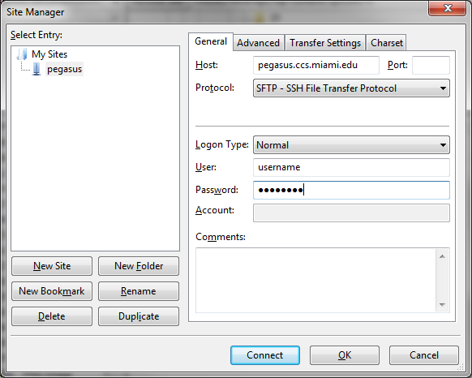

.. _transfer: 

Transferring Files
==================

IDSC systems support multiple file transfer programs such as FileZilla and
PSFTP, and common command line utilities such as ``scp`` and ``rsync``.
Use cluster head nodes (login nodes) for these types of file transfers.
For transferring large amounts of data from systems outside the
University of Miami, IDSC ACS also offers a gateway server that supports
SFTP and Globus.

Using command line utilities
----------------------------

Use ``cp`` to copy files within the same computation system. Use
``scp``, ``sftp``, or ``rsync`` to transfer files between computational
systems (e.g., scratch space to Visx project space). When executing
multiple instantiations of command line utilities like rsync and scp,
please ***limit your transfers to no more than 2-3 processes at a
time.***

scp
~~~

An example transfer might look like this:

::

    [localmachine: ~]$ scp /local/filename \
                username@pegasus.ccs.miami.edu:/scratch/projectID/directory

To transfer a directory, use the ``-r`` flag (recursive):

::

    [localmachine: ~]$ scp -r /local/directory \
                username@pegasus.ccs.miami.edu:/scratch/projectID/directory

Consult the Linux man pages for more information on scp.

rsync
~~~~~

The rsync command is another way to keep data current. In contrast to
scp, rsync transfers only the changed parts of a file (instead of
transferring the entire file). Hence, this selective method of data
transfer can be much more efficient than scp. The following example
demonstrates usage of the rsync command for transferring a file named
"firstExample.c" from the current location to a location on Pegasus.

::

    [localmachine: ~]$ rsync firstExample.c \
                username@pegasus.ccs.miami.edu:/scratch/projectID/directory

An entire directory can be transferred from source to destination by
using rsync. For directory transfers, the options ``-atvr`` will
transfer the files recursively (``-r`` option) along with the
modification times (``-t`` option) and in the archive mode (``-a``
option). Consult the Linux man pages for more information on rsync.

.. _rclone:
rclone 
~~~~~~

The rclone a command-line program that can be used to manage your file over SFTP. Rclone supports over 40 cloud storage backends, as well as standard transfer protocols [like SFTP].  IDSC supports the rclone SFTP backend.

Source: https://rclone.org/sftp/

rclone - SFTP Use Case 1
~~~~~~~~~~~~~~~~~~~~~~~~

This is a use case using rclone to migrate data from legacy storage to **IDSC CES** on **apex.idsc.miami.edu**.  This use case uses default rclone on Pegasus, **rclone v1.39**.

::

    $ ssh pegasus.ccs.miami.edu
    
    [pdavila@login4 ~]$ rclone config
      No remotes found - make a new one
      n) New remote
      s) Set configuration password
      q) Quit config
 
      n/s/q> n
      name> apex
      ...
      18 / SSH/SFTP Connection "sftp"
      ...
      Storage> 18
      SSH host to connect to
      Choose a number from below, or type in your own value
      ...
      host> apex.idsc.miami.edu
      SSH username, leave blank for current username, pdavila
    
      user> pdavila
      SSH port, leave blank to use default (22)
      port> 
      
      SSH password, leave blank to use ssh-agent.
      y) Yes type in my own password
      g) Generate random password
      n) No leave this optional password blank
      y/g/n> y
      
      Enter the password:
      password:
      Confirm the password:
      password:
      Path to unencrypted PEM-encoded private key file, leave blank to use ssh-agent.
      key_file> 
      Enable the user of the aes128-cbc cipher. This cipher is insecure and may allow plaintext data to be recovered by an attacker..
      Choose a number from below, or type in your own value
      1 / Use default Cipher list. "false"
      2 / Enables the use of the aes128-cbc cipher.  "true"
      
      use_insecure_cipher> 
      Remote config
      --------------------
      [apex]
      host = apex.idsc.miami.edu
      user = pdavila
      port = 
      pass = *** ENCRYPTED ***
      key_file = 
      use_insecure_cipher = 
      --------------------
      y) Yes this is OK
      e) Edit this remote
      d) Delete this remote
      y/e/d> y
      Current remotes:
      
      Name                 Type
      ====                 ====
      apex                 sftp
      
      e) Edit existing remote
      n) New remote
      d) Delete remote
      r) Rename remote
      c) Copy remote
      s) Set configuration password
      q) Quit config
      e/n/d/r/c/s/q> q
      
    [pdavila@login4 rclone]$ rclone lsd apex:/
      -1 2022-06-08 12:40:30        -1 hpc
      -1 2022-06-13 17:25:44        -1 schurerlab
 
    [pdavila@login4 rclone]$ rclone mkdir apex:/schurerlab/pdavila
    

**Note:** Because ``rclone copy`` command can take hours to complete, we recommend you use screen when running rclone interactively.  This way the sync will not terminate prematurally, should your ssh session end.

::
    
    [pdavila@login4 ~]$ screen
    [pdavila@login4 ~]$ rclone copy /projects/ccs/schurerlab/cheminfo/pdavila apex:/schurerlab/pdavila
    [pdavila@login4 ~]$ rclone lsd apex:/schurerlab/pdavila/apps/
      -1 2022-06-23 10:36:21        -1 bin
      -1 2022-06-23 10:36:21        -1 ffmpeg
      -1 2022-06-23 10:36:21        -1 firefox
      -1 2022-06-23 10:36:21        -1 wget
        
rclone - SFTP Use Case 2
~~~~~~~~~~~~~~~~~~~~~~~~

In this second use case, we will install the latetest version of rclone to our home directory and then use the new arguments like ``--sftp-host`` to migrate data from legacy storage to **IDSC CES**. This assumes you have already **configured** your rclone SFTP as instructed above in the first rclone use case.

Sources: https://rclone.org/install/

::
    
    $ ssh pegasus.ccs.miami.edu
    
    [pdavila@login4 rclone]$ rclone copy --sftp-host apex.idsc.miami.edu /projects/ccs/schurerlab/cheminfo/pdavila apex:/schurerlab/pdavila
      Error: flag needs an argument: --sftp-host
      Usage:
        rclone copy source:path dest:path [flags]
      ... # Pegasus's default rclone, v1.39, does not support --sftp-host argument
    
    # Install latest rclone
    [pdavila@login4 ~]$ which rclone
      /usr/local/bin/rclone
      
    [pdavila@login4 ~]$ rclone -V
      rclone v1.39
      - os/arch: linux/386
      - go version: go1.9.2
 
 Install latest rclone.
 
 ::
 
    [pdavila@login4 ~]$ mkdir -p apps/rclone
    [pdavila@login4 ~]$ cd apps/rclone    
    [pdavila@login4 rclone]$ curl -O https://downloads.rclone.org/rclone-current-linux-amd64.zip
    [pdavila@login4 rclone]$ unzip rclone-current-linux-amd64.zip
    [pdavila@login4 rclone]$ mv rclone-v1.58.1-linux-amd64/ 1.58.1
    [pdavila@login4 rclone]$ echo "export PATH=/nethome/pdavila/apps/rclone/1.58.1/:$PATH: >>$HOME/.bash_profile  # Change your profile's default rclone to one in your home directory.
    [pdavila@login4 rclone]$ Source >> $HOME/.bash_profile

    [pdavila@login4 rclone]$ which rclone
      ~/apps/rclone/1.58.1/rclone

    [pdavila@login4 rclone]$ rclone -V
      rclone v1.58.1
      - os/version: centos 7.6.1810 (64 bit)
      - os/kernel: 3.10.0-957.el7.x86_64 (x86_64)
      - os/type: linux
      - os/arch: amd64
      - go/version: go1.17.9
      - go/linking: static
      - go/tags: none
 
 Now run the same rclone copy command using rclone 1.58.1.
 
 ::
 
    [pdavila@login4 rclone]$ rclone copy --sftp-host apex.idsc.miami.edu /projects/ccs/schurerlab/cheminfo/pdavila apex:/schurerlab/pdavila
    [pdavila@login4 rclone]$ 
    

Using FileZilla
---------------

FileZilla is a free, user friendly, open source, cross-platform FTP,
SFTP and FTPS application.

Download the FileZilla client here:
https://filezilla-project.org/download.php?show_all=1 and follow the
installation instructions for the appropriate platform
(http://wiki.filezilla-project.org/Client_Installation).

Launch FileZilla and open **File : Site Manager**.

Click the "New Site" button and name the entry.  Pegasus example::

    Host:       pegasus.ccs.miami.edu | triton.ccs.miami.edu | apex.idsc.miami.edu (CES)
    Protocol:   SFTP
    Logon Type: Normal
    enter your username and password

Selecting Logon Type: **Ask for password** will prompt for a password
each connection.\ |FileZilla Site Manager|

Click the "Connect" button. Once connected, drag and drop files or
directories between your local machine and the server.

Using the gateway server
------------------------

To transfer large amounts of data from systems outside the University of
Miami, use the gateway server. This server supports SFTP file
transfers. Users ***must be a member of a project*** to request access
to the gateway server. E-mail hpc@ccs.miami.edu to request access.

SFTP
~~~~

::

    Host:  xfer.ccs.miami.edu
    protocol:  SFTP
    user:    caneid
    pw:  [UM caneid passwd]  
    Folder: download/<projectname>

Open an SFTP session to the gateway server using your IDSC account
credentials: ``xfer.ccs.miami.edu``

::

    [localmachine: ~]$ sftp username@xfer.ccs.miami.edu
    sftp> cd download
    sftp> mkdir <project>
    sftp> cd project
    sftp> put newfile

